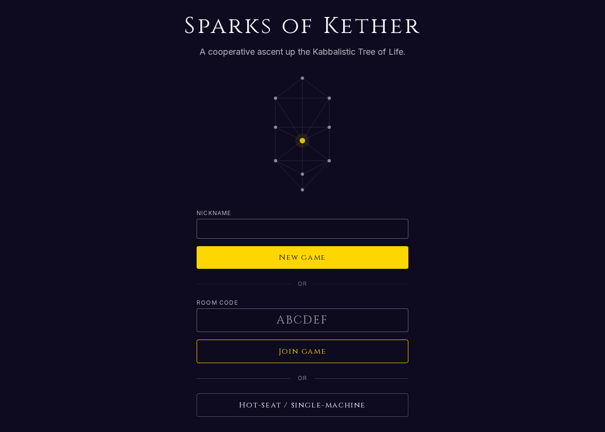
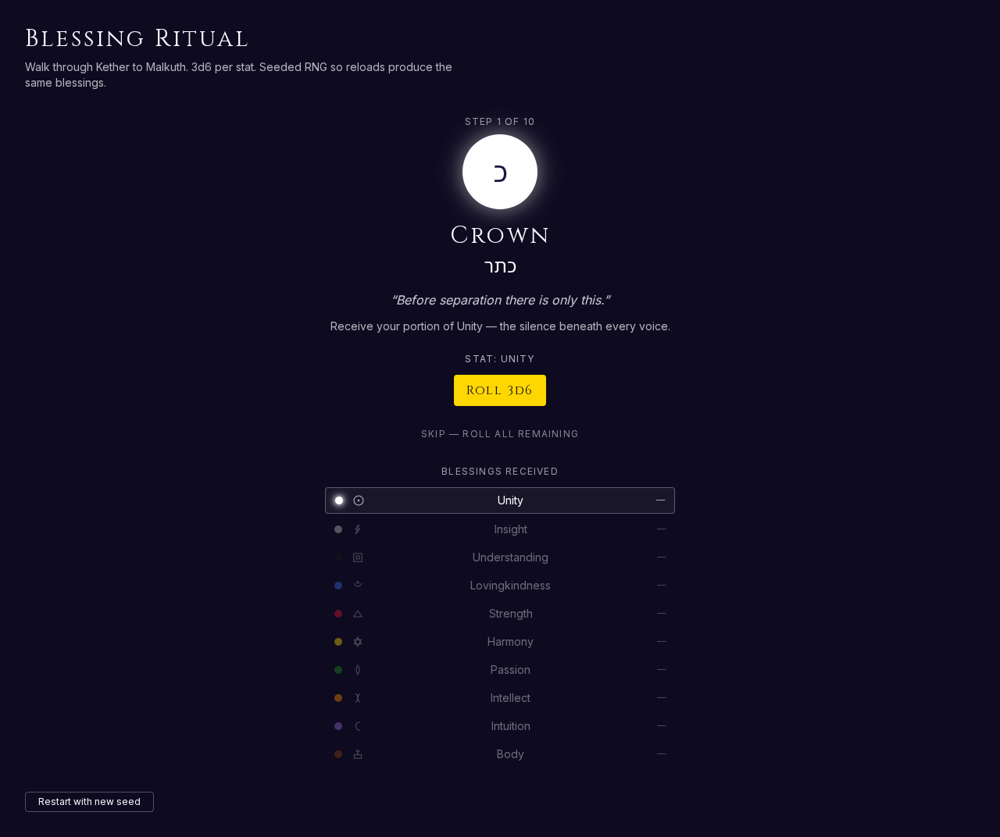
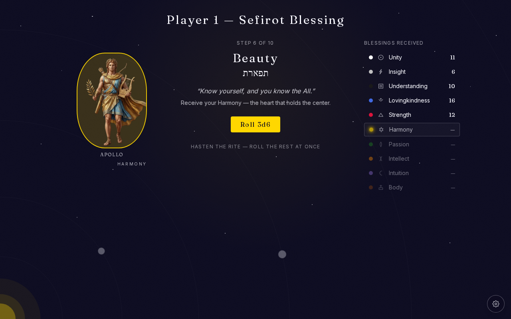
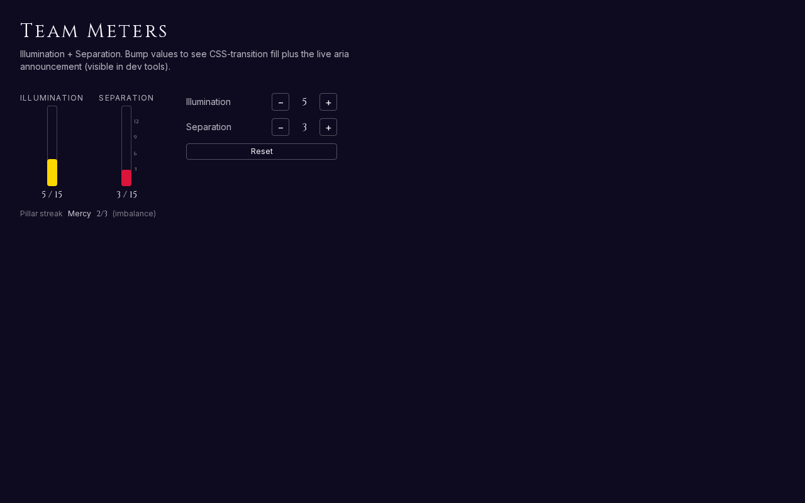
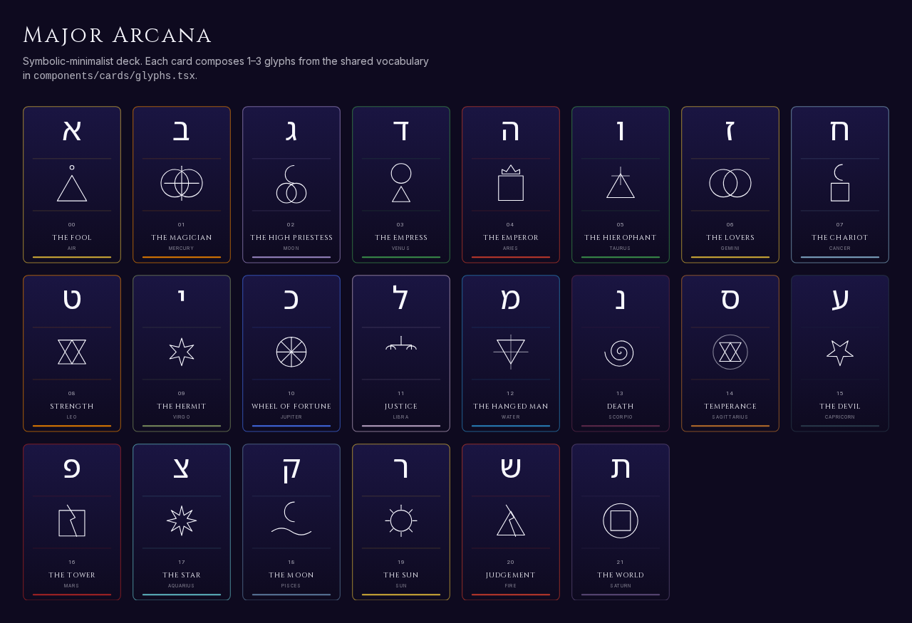

# Sparks of Kether

> _A cooperative ascent up the Kabbalistic Tree of Life._




**[Read the rules](design/mechanics.md)** · **[Run it locally](#running-the-web-app)** · **[See the screenshots](assets/marketing/README.md)**

---

2–4 players journey together from Malkuth (the material world) to Kether (the
Crown). Along the way, each Sefirah you visit grants you a **Spark** — a
lesson and a one-use ability — and each Spark brightens the team's shared
**Illumination**. Fail a challenge, hoard resources, or take the wrong
shortcut, and **Separation** rises instead; the **Shells** awaken and the
Tree begins to dim.

You win by reaching the Crown together with more Illumination than
Separation. You lose by letting the Shells swallow the Tree. Evil here is
separation and ignorance. Good is illumination and unity. The mechanics
aren't decoration — they teach the thing.

This repo is a **game-design document**, medium-agnostic. It could be
realized as a board game, a card game, a web app, or a computer game. The
soul of the game lives here; any implementation is downstream.

## Where to look

| If you want... | Read |
|---|---|
| The rules of play | [`design/mechanics.md`](design/mechanics.md) |
| The shadow mechanic | [`design/shells.md`](design/shells.md) |
| What each Sefirah is and does | [`reference/sefirot.md`](reference/sefirot.md) |
| The 22 Hebrew letters and their paths | [`reference/hebrew-letters.md`](reference/hebrew-letters.md) |
| The 22 Major Arcana as path-keys | [`reference/arcana.md`](reference/arcana.md) |
| The path network at a glance | [`reference/paths.md`](reference/paths.md) |
| Cross-system correspondences | [`reference/correspondences.md`](reference/correspondences.md) |
| The long-form ideation that started all this | [`KabballahGame.md`](KabballahGame.md) |

The `reference/` files are the raw source of truth for the symbolic system;
the `design/` files describe how the game uses them.

## Gameplay

A walk through the surfaces in the order a player meets them.

| | |
|---|---|
|  | **The opening ritual.** Walk Kether to Malkuth, rolling 3d6 for each Sefirah's stat, then pick your zodiac class — its dignities tilt your starting stats. The atmosphere shifts hue with the active Sefirah; a running ledger keeps the build visible. |
|  | **The board.** Ten Sefirot connected by twenty-two paths — the geometry the team traverses together. |
|  | **The play surface.** Board, hand, and shared meters all in view; class-derived stat bonuses are folded in by start of play. |
|  | **Illumination vs Separation.** The two team-wide counters that decide the run. Pillar-streak columns track which side of the Tree the team has been favouring. |
|  | **22 path-keys.** A symbolic-minimalist deck of the Major Arcana — each card a key, each key a path between Sefirot. |

For a stable image URL set (e.g. for sharing or for a future
landing page), see [`assets/marketing/README.md`](assets/marketing/README.md).

## Running the web app

The web implementation is a Next.js 14 (App Router) project using
TypeScript strict mode and pnpm. Node 20+ required.

```bash
# one-time setup — enables pnpm via Node's corepack
corepack enable

# install dependencies
pnpm install

# dev server on http://localhost:3000
pnpm dev

# production build
pnpm build

# gate commands (run before every push)
pnpm typecheck && pnpm lint
```

Directory layout:

| Path | Purpose |
|---|---|
| `app/` | Next.js App Router routes |
| `components/` | React components |
| `engine/` | Pure game logic (no React, no side effects) |
| `data/` | Typed data derived from `reference/*.md` |
| `lib/` | Utilities and hooks |
| `test/` | Test helpers (fixtures, mocks) |

See [`CLAUDE.md`](CLAUDE.md) for the working agreement, and the
[Epic issue](https://github.com/swamp-dev/sparks-of-kether/issues/1) for
implementation tracking.

## Multiplayer setup (Supabase)

Real-time multiplayer rooms run on Supabase (Postgres + Realtime + anonymous
auth). Single-player / hot-seat play does NOT need this; only set this up
when you want online rooms.

1. **Create a Supabase project.** Free tier is fine. Note the project URL and
   the **anon (public)** API key from `Project Settings → API`.
2. **Apply the migration.** From the project root:
   ```sh
   # Option A: Supabase CLI (recommended)
   supabase link --project-ref <your-ref>
   supabase db push
   # Option B: paste supabase/migrations/0001_init.sql into the SQL editor
   ```
3. **Wire env vars.** Copy `.env.example` to `.env.local` and fill in:
   ```
   NEXT_PUBLIC_SUPABASE_URL=https://<ref>.supabase.co
   NEXT_PUBLIC_SUPABASE_ANON_KEY=eyJ...
   ```
   `.env.local` is gitignored. Never commit real keys.
4. **Verify.** `pnpm dev` should start without env errors. The lobby UI
   (next ticket) will use these to create and join rooms.

The schema's RLS policies enforce "you can only read/write rooms you've
joined." Server-side validation (turn ownership, action authorization) lives
in edge functions in a later ticket.
