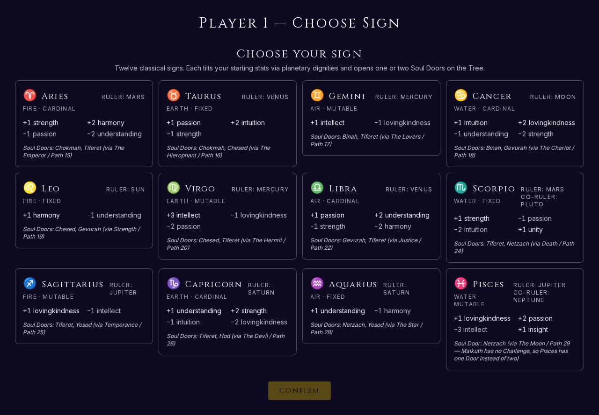
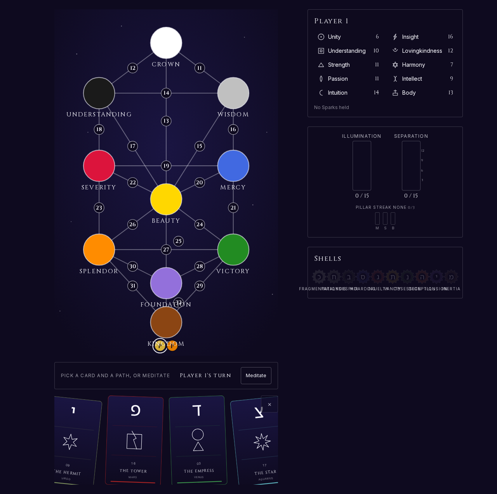
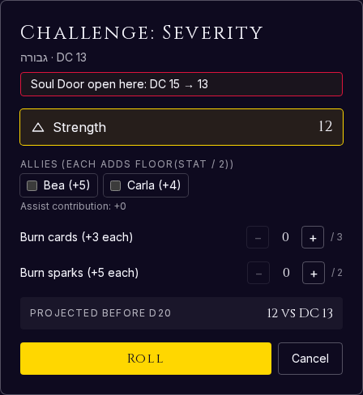

# Screens — Visual tour

A contributor-facing index of every screen in the app, with an embedded
desktop screenshot for each. The point is fast onboarding: skim this
file and you know what every route looks like before you go reading
component code.

Curated marketing imagery (the README hero, the gameplay gallery) is a
separate, hand-picked subset — see
[`assets/marketing/README.md`](../assets/marketing/README.md) for that
pack. This tour is exhaustive instead of curated; every route the
review screenshot spec touches has an entry below.

---

## Public routes

These ship in production and are reachable without any flag.

### `/` — the landing

The marketing-leaning home page: title, hero band, room CTAs (host /
join). Entry point for new players.

### `/about` — the marketing tour

Long-form pitch: what the game is, the symbolic system, screenshots,
contributor links. The deeper "what is this" surface for visitors who
clicked through from the landing.

### `/play` — the hot-seat play surface (opening ritual)

The local-only hot-seat surface, captured at STEP 6 OF 10 of the
Blessing Ritual — five Sefirot rolled, Tiferet/Beauty active, the
ledger filling in. The multiplayer rooms variant lives at
`/rooms/[code]/lobby` (see "Captured separately" below).

The /play route is a state machine. The next two captures show two
later states of the same route, since they're meaningfully different
surfaces from a player's perspective.

### `/play` — zodiac sign picker (post-ritual)

After the ritual completes, the picker appears — twelve classical
signs with stat dignities and Soul Door copy per sign. Headline UI
of Epic #212 (astrological-sign classes). Captured by walking past
the ritual via "Skip — roll all remaining" + "Continue".

### `/play` — live play surface (post-setup)

After both players complete setup and the host clicks Begin, the
live `PlayScreen` mounts: Tree of Life board, hand fan, team meters,
Shells row, and turn UI all in view. Captured by walking the full
setup pipeline (ritual P1 → Aries → ritual P2 → Leo → Begin).

---

## Dev tooling

Reachable only in development; production builds 404 these routes via a
`NODE_ENV !== 'production'` guard so unfinished UI never lands publicly.

### `/tokens` — design-token gallery

Visual swatch sheet for every Sefirah color token and the typography
stack. Used to spot-check that Tailwind utilities resolve to the
intended design tokens.

---

## Component demos

Every `/demo/*` route is a focused harness for a single component or
visual subsystem. They all 404 in production (same guard as `/tokens`).
Listed alphabetically by slug.

### `/demo/cards` — Major Arcana grid

All 22 Major Arcana rendered in a single grid using the shared
`ArcanumCard` glyph vocabulary. Clearest "this is a card game" surface.

### `/demo/challenge` — challenge resolution

The challenge-resolution UI: DC, stat being checked, allies, burn
cards/sparks dials, projected total. Pre-roll state. The same demo
also accepts `?door=open` and `?shortcut=1` search params to seed
state — the next entry shows the Soul Door variant.

### `/demo/challenge?door=open` — challenge with Soul Door callout

Same modal, with Epic #240's "Soul Door open here: DC 15 → 13" band
visible at the top. The DC line in the header reflects the adjusted
value (13 vs the base 15). Captured deterministically via the search
param — see `app/demo/challenge/page.tsx`.

### `/demo/hand` — player hand

The player's hand component in isolation — fan layout, hover affordance,
selection state.

### `/demo/icons` — icon gallery

Every icon glyph used across the app, in one grid. Visual regression
target for icon fidelity.

### `/demo/meters` — team meters

`TeamMeters` with gradient fills and pillar columns. Compact "look at
the polish" shot.

### `/demo/ritual` — Blessing Ritual scene

Mid-step Blessing Ritual: Sefirah-keyed bloom and step ledger.
Atmospheric setup-phase surface — this is what each player sees at
game start as they walk Kether → Malkuth and roll their stats.

### `/demo/shell-panel` — Shell panel

The Shell-of-Sefirah panel — descriptive Shell readout, tone, and
counter-move affordances. Drives the encounter UI.

### `/demo/stat-sheet` — stat sheet

The per-player stat sheet — class, virtues, hand-room, condition tags.

### `/demo/tokens` — token components

Small-piece token components (the on-board pawns and markers) in
isolation, separate from the swatch sheet at `/tokens`.

### `/demo/tree` — Tree of Life

Static Tree of Life with every Sefirah lit at full visibility. The
"what's the geometry" reference shot.

---

## Captured separately

`/rooms/[code]/lobby` is a real multiplayer route; reaching it requires
either a real Supabase room code or a mocked one wired through the e2e
harness. The review screenshot spec
([`e2e/screenshots.review.spec.ts`](../e2e/screenshots.review.spec.ts))
walks static routes only, so the lobby is intentionally out of scope
here. The visual regression suite covers it via its own seeded
fixtures; pull a current still from
`e2e/visual-regression.spec.ts-snapshots/` if you need one for a doc.

---

## How this is generated

The screenshots in `docs/screenshots/` are desktop captures (1280×800)
from the multi-viewport review spec at
[`e2e/screenshots.review.spec.ts`](../e2e/screenshots.review.spec.ts),
run via `pnpm screenshots`. The spec writes to the gitignored
`e2e/__screenshots__/baselines/` directory; the desktop captures get
copied into `docs/screenshots/` by hand when this tour is refreshed.
The curated marketing pack at [`assets/marketing/`](../assets/marketing/)
is a separate, hand-picked subset for external-facing surfaces — keep
the two distinct.
